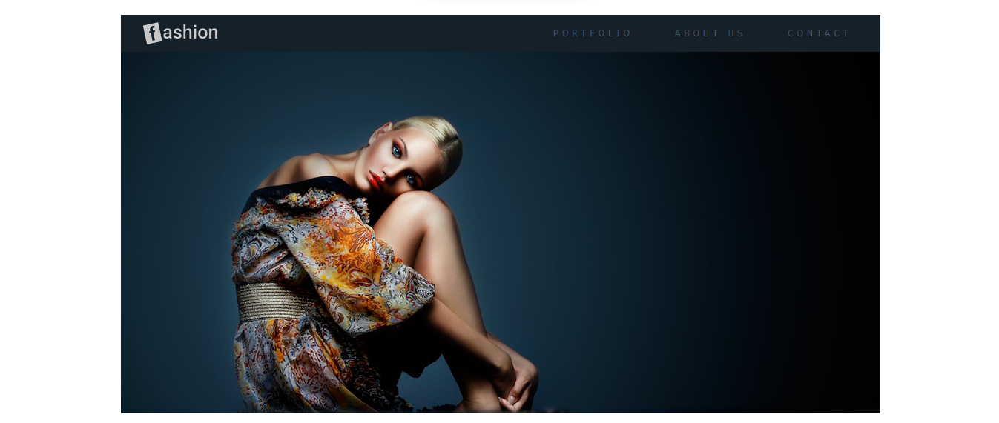

<!-- Título -->

<h1 align="center">Fashion</h1>

<!-- Descrição -->

Blog de modelos simples

<!-- Súmario -->

 <a href="#features">Features</a> •
 <a href="#rodando-a-aplicação">Rodando A Aplicação</a> •
 <a href="#tecnologias">Tecnologias</a> •
 <a href="#autor">Autor</a>

<!-- Site -->

<h2 align="center">Site</h2>

 <a href="https://fashion-mathueuspalmieri.netlify.app/">Site Do Projeto</a>

<!-- Atualizações -->

### Features

- [x] Criar logo
- [x] Corrigir Imagens

---

### Rodando A Aplicação

<a href="https://fashion-mathueuspalmieri.netlify.app/">Site Do Projeto</a>

---

### Tecnologias

As seguintes ferramentas foram usadas na construção do projeto:

- [HTML](https://html.com/)
- [CSS](https://html.com/css/)

---

### Autor

Create for <b>`Matheus Palmieri`</b>👨‍💻

 
 

🎉Projeto Fashion Finalizado🚀

